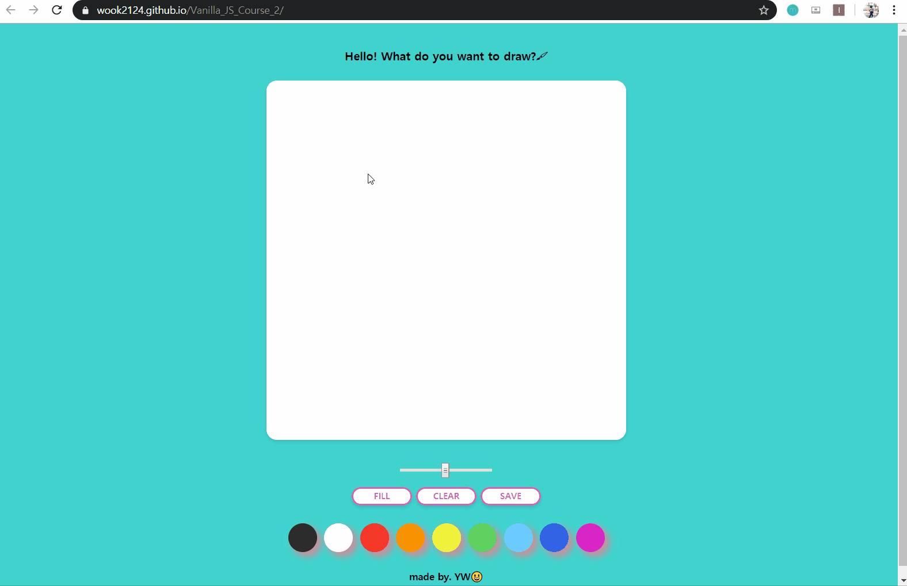

# Vanilla JS Course 2

Nomad Coders's Vanilla JS Course 2  
`2020.02.28. ~ 2020.03.04.`

## Demo Link

- [Vanilla JS Course 2](https://wook2124.github.io/Vanilla_JS_Course_2/)

## Demo Video

## Project Description 

This is a paint site. Refer to the `Feature` below for the functions and enjoy your drawing!  
그림을 그릴 수 있는 웹페이지입니다. 기능들은 아래 `Feature`를 참고해주세요.

### `Feature` 

- Draw a line (선으로 그리기)
- Change brush size (브러쉬 사이즈 변경)
- Fill canvas (캔버스 전체 색칠하기)
- Clear canvas (캔버스 초기화하기)
- Save your drawing (그림 파일로 저장하기)
- Change color (색 변경)

## Customization: How to run this project

Very simple. Click [Vanilla JS Course 2](https://wook2124.github.io/Vanilla_JS_Course_2/) and Enjoy!  
[Vanilla JS Course 2](https://wook2124.github.io/Vanilla_JS_Course_2/) 클릭하고 사용하면 됩니다.

## What I used for this project 

 - [X] HTML
 - [X] CSS
 - [X] JavaScript
